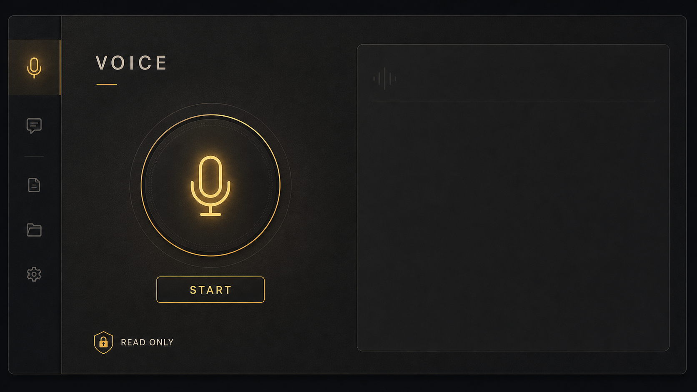
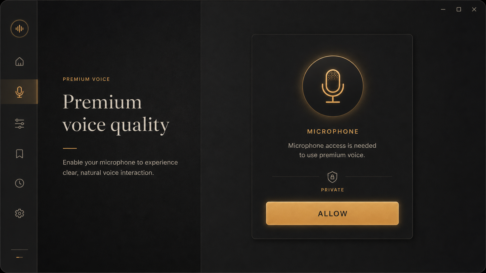
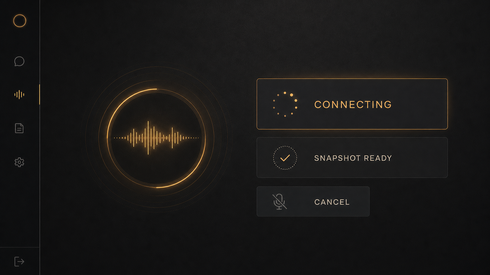
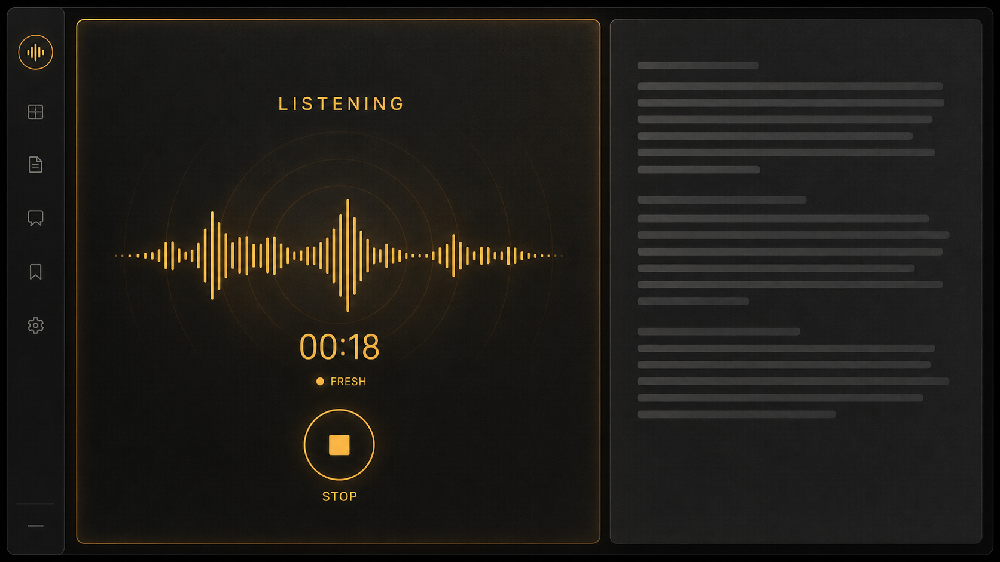
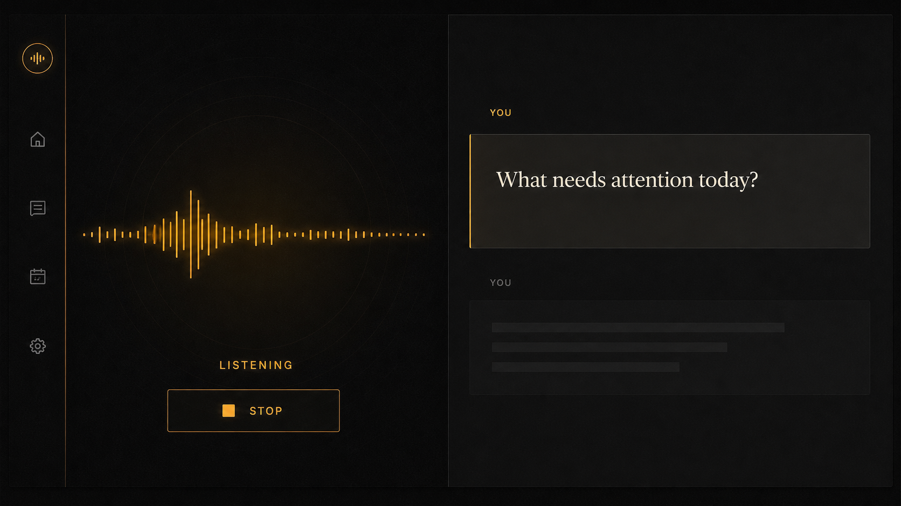
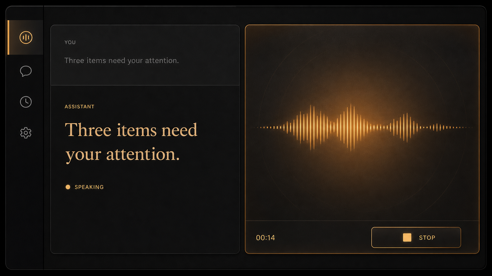
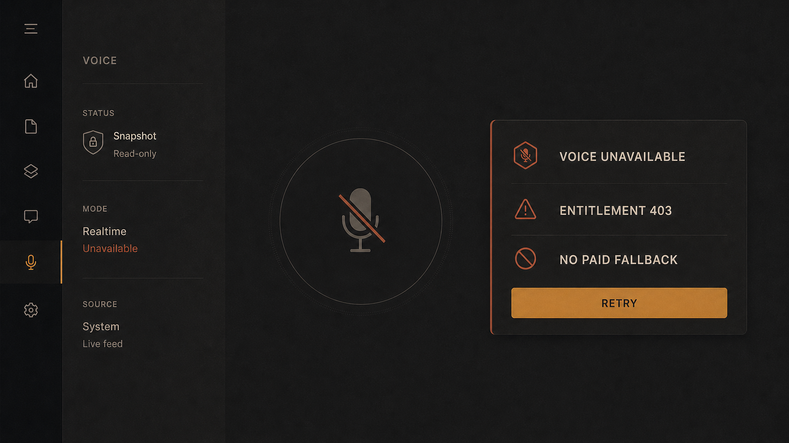
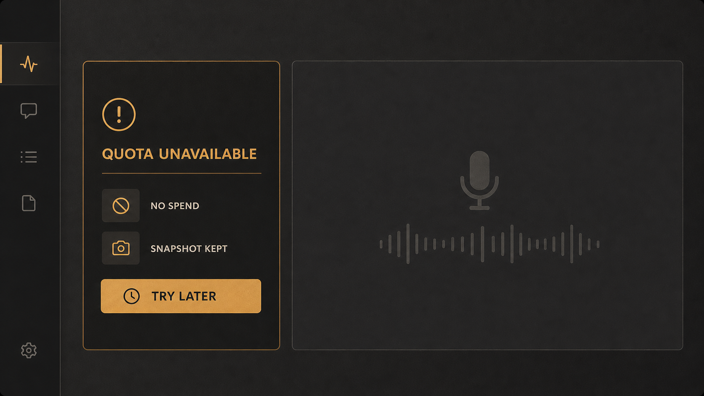
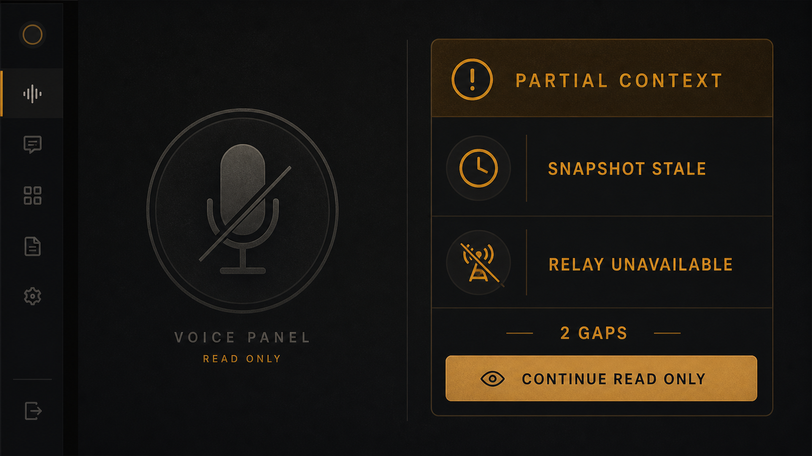
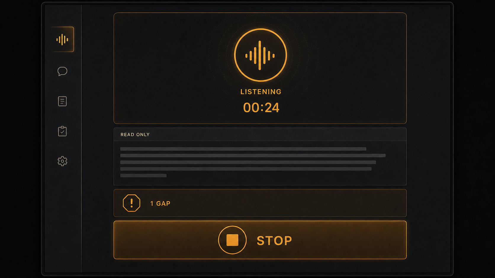

# Buzz Voice Panel

Issue #13 adds a read-only `/voice` surface backed by Codex Realtime through the existing ChatGPT subscription login. It never uses `OPENAI_API_KEY`, a paid API fallback, an upgrade, or a mutating tool.

## Preflight evidence

- Issue #2 is closed.
- Issue #14 is the follow-up Voice-State-Tools scope, not a prerequisite.
- OAuth issue #18 is closed.
- `codex login status` reports `Logged in using ChatGPT`.
- `OPENAI_API_KEY` was absent from the environment and explicitly removed from the live probe child.
- `codex app-server --stdio --enable realtime_conversation` initialized with model `gpt-5.6-sol` and delivered `thread/realtime/sdp` for voice `spruce`; no 403 or quota error occurred.
- The immediate `thread/realtime/start` result was `{}`. The client therefore waits for the SDP notification instead of treating acknowledgement as success.

## Security boundary

- One process-backed Rust actor serializes app-server JSON-RPC.
- The frontend owns microphone capture, WebRTC, remote audio, transcript rendering, and cleanup.
- Session instructions contain only a maximum 16-KiB local snapshot and explicit read-only refusal rules.
- No Realtime tools are attached.
- Snapshot inputs are the existing local cockpit contract plus a direct authenticated relay query.
- Missing sources are named gaps; they are never represented as zero or healthy.
- SDP, snapshot content, signing keys, auth tokens, environment values, and hidden paths are not logged.
- Stop is idempotent and terminates the app-server child when the actor can no longer be reused safely.

## Visual system

The ten references below were generated on 2026-08-13 through the built-in keyless image-generation path. That path requires no `OPENAI_API_KEY` and caused no user spend. Their prompts and SHA-256 hashes are recorded in [`voice-visuals/manifest.json`](voice-visuals/manifest.json).

The implementation takes four recurring decisions from this set:

- near-black ink/graphite surface with subtle noise rather than a generic AI gradient;
- warm amber reserved for active state, focus, and the primary action;
- one large voice control paired with a quieter transcript/context region;
- explicit entitlement, quota, and source-gap states that never masquerade as success.

### 01 — Idle

### 02 — Microphone permission

### 03 — Connecting

### 04 — Listening

### 05 — User transcript

### 06 — Assistant speaking

### 07 — Entitlement denied

### 08 — Quota unavailable

### 09 — Snapshot gaps

### 10 — Narrow laptop

## Local verification contract

The supported Windows parity gate is the sequence documented in `.empire/BUILD.md`: workspace format and clippy, Tauri format, desktop and web checks, and unit tests. Whole-desktop Windows Tauri clippy findings already named there are baseline exceptions; warnings introduced by the voice module are not accepted.

Live proof runs with `OPENAI_API_KEY` absent. Success requires a real `thread/realtime/sdp` notification, route rendering, deterministic WebRTC lifecycle coverage, and clean stop. Physical microphone interaction is recorded separately when desktop automation cannot grant the host device.

## Local proof — 2026-08-14

- A no-key `codex app-server --stdio --enable realtime_conversation` probe initialized through the existing ChatGPT login, started thread `019ffcb6…`, and received a real `thread/realtime/sdp` notification for `spruce` with no entitlement or quota error.
- The focused Rust suite passed 12/12 tests after a fresh Tauri test build, including read-only params, acknowledgement-vs-SDP sequencing, sanitized errors, snapshot gaps, and the 16-KiB bound.
- The focused frontend suite passed 7/7 tests, including WebRTC negotiation and failure cleanup.
- Chromium E2E passed 1/1: sidebar navigation, `/voice`, `voice_start`, snapshot rendering, clean `voice_stop`, and zero page errors.
- The E2E screenshot is [`voice-panel-live-proof.png`](voice-panel-live-proof.png), SHA-256 `6e9ec6202066d9cbc8b3aa42c94306658b648ec19dab4689063aefe510ee69e5`.
- The browser fixture replaces the host microphone and peer connection deterministically; the no-key app-server probe supplies the local entitlement/SDP parity that browser automation cannot exercise through Tauri IPC.
